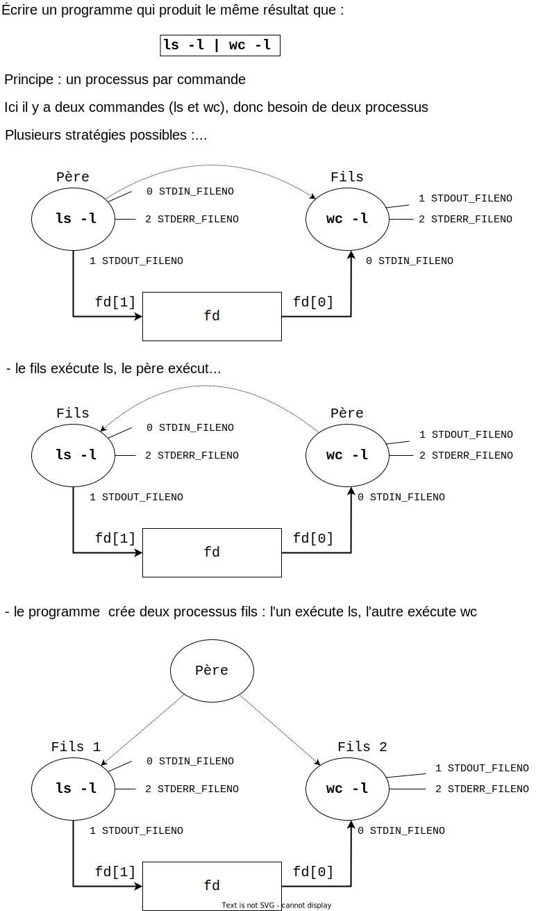

# Séance 6 - Tubes

## Primitives utilisées dans ce TP 

```c
int pipe(int fildes[2]);
pid_t fork(void);
pid_t wait(int *status);
int dup(int oldfd);
int dup2(int oldfd, int newfd);
```


## Rappels sur les redirections 

On rappelle que lors de la création d'un descripteur de fichier, par
exemple par `open` lors de l'ouverture d'un fichier ou par `dup` lors de la duplication d'un descripteur existant, la première
entrée libre dans la table des descripteurs est utilisée. On rappelle
également que les entrées 0, 1 et 2 correspondent respectivement à
l'entrée, la sortie et l'erreur standard.

Pour rediriger, en supposant que les premières entrées de la table des
descripteurs sont utilisées, il suffit donc de fermer le descripteur
souhaité (pour rendre son entrée disponible) et d'en créer ou d'en
dupliquer un autre (pour prendre sa place).

Par exemple :

```C 
int tube[2];
pipe(tube);   // On crée un tube.
close(1);     // On supprime le descripteur occupant l'entrée 1 (sortie standard),
              // ce qui rend cette entrée disponible.
dup(tube[1]); // On duplique le descripteur en écriture du tube,
	          // il va donc occuper l'entrée 1 correspondant à la sortie standard.
	          // À partir de maintenant, printf() ou write(1,...) vont écrire dans le tube !
``` 

ou :


```C 
int tube[2];
pipe(tube);   // On crée un tube.
dup2(tube[1],1);  // On duplique le descripteur en écriture du tube,
	              // il va donc occuper l'entrée 1 correspondant à la sortie standard.
	              // À partir de maintenant, printf() ou write(1,...) vont écrire dans le tube !
``` 

 **Attention, ci-dessus les erreurs ne sont pas testées  pour simplifier la lisibilité**

**Dans votre code, vous devrez bien entendu tester toutes les erreurs**

## Objectifs de ce TP :
* appréhender la notion de tube anonyme en programmation système
* savoir utiliser les redirections en combinaison avec les tubes

## Bonnes pratiques

* Pour réaliser ces TP, vous mettrez en œuvre les bonnes pratiques de programmation énoncées ici : https://pdagog.gitlab.io/ens/conseils.pdf
* Les erreurs retournées par les primitives systèmes seront systématiquement testées, soit à l'aide de la fonction `raler`, soit avec la macro `CHK`:
https://moodle.unistra.fr/pluginfile.php/230879/mod_resource/content/3/fonction_raler.c
* Dans chaque répertoire de TP, vous écrirez un fichier `Makefile` permettant de compiler l'ensemble des fichiers du TP, ainsi qu'une cible `clean`
* Dans chaque répertoire de TP, vous écrirez un court rapport `rapport.md` au format Markdown dans lesquel vous répondrez aux différentes questions du sujet de TP.
* Vous effectuerez des `commit` réguliers de votre travail, et un `push` en fin de séance.


## Exercice 1 - Lecteur / écrivain

Écrivez et testez les programmes suivants :

- `pipe_a.c` : le programme crée un processus fils, le père envoie dans un tube la chaîne "Je suis le père et je transmets ce message à mon fils", le fils récupère le message dans le tube et l'affiche
- `pipe_b.c` : le programme crée un processus fils, le fils 
 envoie dans un tube la chaîne "Je suis le fils et je transmets ce message à mon père", le père récupère le message dans le tube et l'affiche
- `pipe_c.c` : le programme crée deux processus fils, le premier fils envoie dans un tube la chaîne "Je suis le fils 1 et je transmets ce message à mon frère", le second fils récupère le message dans le tube et l'affiche, le père attend la terminaison de ses deux fils, récupère leur code de retour et affiche le message "Je suis le père et mes fils se sont terminés avec les codes :  ... et ..."

**Questions :**

1. Dans quel cas une écriture dans un tube est bloquante ?
2. Dans quel cas une lecture dans un tube est bloquante ?
3. Que se passe-t-il quand un processus effectue une écriture dans un tube sur lequel il n'y a aucun lecteur ?
4. Dans le programme `pipe_c.c` que se passe-t-il si le père ne ferme pas l'extrémité en écriture du tube ? Pourquoi ?

## Exercice 2 - Redirections (1)

Écrivez un programme qui permet de faire l’équivalent de la commande suivante :

```console
ls -l| wc -l
```

Vous écrirez trois versions de ce programme (voir schéma ci-dessous) :
* `pipe_red1a.c` : le programme crée un processus fils, le père est l'écrivain et le fils est le lecteur
* `pipe_red1b.c` : le programme crée un processus fils, le fils est l'écrivain et le père est le lecteur
* `pipe_red1c.c` : le programme crée deux processus fils, le premier fils est l'écrivain, le second fils est le lecteur, le père attend la terminaison de ses deux fils.





## Exercice 3 - Redirections (2)

Écrivez un programme `pipe_red2.c` qui permet de faire l’équivalent de la commande suivante :

```console
ps eaux | grep "ˆ<nom>" | wc -l
```

Le programme crée trois processus fils ; chaque processus fils exécute une commande. Après la création des fils, le père attend leur terminaison.

Le nom sera donné par l’utilisateur en argument du programme, ou prendra la valeur de la variable d’environnement `USER` par défaut. 
